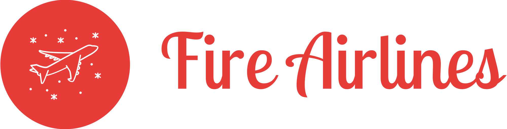
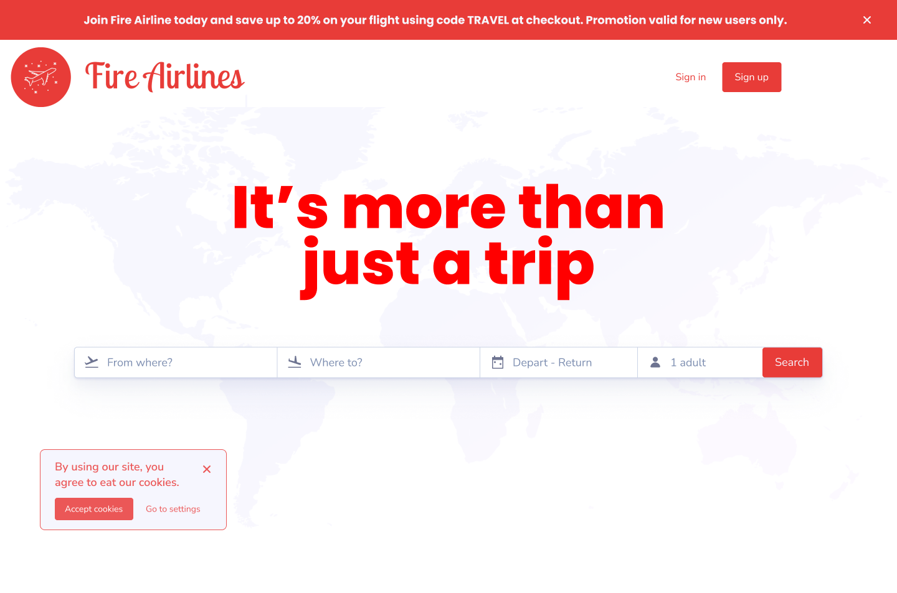
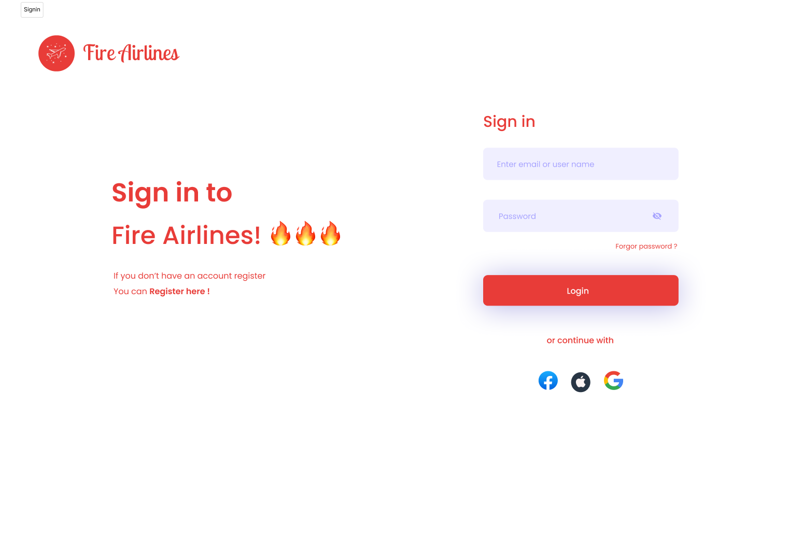

<!-- Improved compatibility of back to top link: See: https://github.com/othneildrew/Best-README-Template/pull/73 -->

<!--
*** Thanks for checking out the Best-README-Template. If you have a suggestion
*** that would make this better, please fork the repo and create a pull request
*** or simply open an issue with the tag "enhancement".
*** Don't forget to give the project a star!
*** Thanks again! Now go create something AMAZING! :D
-->

<!-- PROJECT SHIELDS -->
<!--
*** I'm using markdown "reference style" links for readability.
*** Reference links are enclosed in brackets [ ] instead of parentheses ( ).
*** See the bottom of this document for the declaration of the reference variables
*** for contributors-url, forks-url, etc. This is an optional, concise syntax you may use.
*** https://www.markdownguide.org/basic-syntax/#reference-style-links
-->
[![Contributors][contributors-shield]][contributors-url]
[![FPT][FPT-shield]][FPT-url]

[![LinkedIn][linkedin-shield]][linkedin-url]

<!-- PROJECT LOGO -->
 

  

<h3 align="center">Flight Management System</h3>

  

  A comprehensive flight management system designed to efficiently handle flight schedules, customer reservations, and bookings.
     
    <a href="https://github.com/dunghuynh-teaching/prj301-se1867-05.git"><strong>Explore the docs »</strong></a>
     
     
    <a href="https://github.com/dunghuynh-teaching/prj301-se1867-05.git">View Demo</a>
    ·
    <a href="https://github.com/dunghuynh-teaching/prj301-se1867-05/issues">Report Bug</a>
    ·
    <a href="https://github.com/dunghuynh-teaching/prj301-se1867-05/issues">Request Feature</a>
  

<!-- TABLE OF CONTENTS -->

  
Table of Contents

  <ol>
    <li>
      <a href="#about-the-project">About The Project</a>
    </li>
    <li>
      <a href="#requirement">Requirement</a>
    </li>
    <li><a href="#usage">Wireframe and Screenshots of the systems</a></li>
    <li><a href="#roadmap">Database Design</a></li>
    <li><a href="#contributing">System Design</a></li>
    <li><a href="#license">Conclusion and Discussion</a></li>
    <li><a href="#contact">Contact</a></li>
    <li><a href="#acknowledgments">Acknowledgments</a></li>
    <li><a href="#contributing">Contributing</a></li>
    <li><a href="#license">License</a></li>
</ol>

<!-- ABOUT THE PROJECT -->
## About The Project

This project serves as an assignment for the PRJ301 - Programming with Java Web at FPT University. Students are tasked with applying the Java programming knowledge acquired in the pre-requisite course, PRO192 (Programming OOP with Java) and apply them in conjunction with database knowledge gained from DBI202 (Introduction to Database). to develop a practical, real-life application.

(<a href="#readme-top">back to top</a>)

## Requirement
- Project name: Fire Airlines
## Purpose

- Fire Airlines allows customers to book flights, check-in, select seats, track reservations, and manage travel plans. The platform provides information on schedules, fares, in-flight services, and airline programs to assist travelers with trip planning and ticketing.

## Objects

- **Users:** Users can manage and purchase tickets for passengers.
- **Admin:** Admin oversees all aspects of the system, including users, flights, and more.

## Features

### About User

#### Login

- Sign up for a new account.
- Sign in as a user (if logged in as an admin account, redirected to the admin's management page).

#### Account

- View and edit user account information.
- Change the user account password.

#### Booking Flight

- Search all flights with the same departure point, landing point, and departure date.
- Select a flight for booking (login necessary).
- Fill in passenger ticket information, select seats for each passenger (required), and choose luggage weight (optional).
- Fill in ticket information for the next passenger after clicking "Save."
- Confirm buying ticket(s) by clicking "Purchase" or "Add to cart" without purchase.

#### Booking History

- View the purchase history, including general invoice information and the total ticket price.
- Click "detail" to show details of each invoice, such as flight, ticket, and seat information.
- Confirm purchase or delete saved invoices.

### About Admin

#### Manage Flights

- View flights.
- Filter flights by airlines, departure points, or landing points.
- Add, edit, or remove flights.

#### Manage Users

- View users.
- Edit or remove users.

#### Manage Invoices

- View invoices and remove invoices.
- Calculate revenue, show total passengers, revenue, and flights in a chosen specific period of time.

(<a href="#readme-top">back to top</a>)

## Wireframe and Screenshots of the system
- This is our first page.

- When clicking in Sign Up button, this page will pop-up prompting users to create their accounts.

- When clicking in Sign In button, this page will pop-up prompting users to log in the website with their existing accounts.

- Our introduction page.

- Our offers/booking page.

- This is our UI for users to book and reserver seats.

- This page is used to get users information when they booked seats.

- Contributors

 ### Built With

* [![HTML][HTML.com]][HTML-url] 
* [![CSS][CSS.com]][CSS-url] 
* [![Bootstrap][Bootstrap.com]][Bootstrap-url] 
* [![Figma][Figma.com]][Figma-url] 

(<a href="#readme-top">back to top</a>)

## Usage
- Below is the demonstration  the functionality of our booking website.

<!-- ### Built With

* [![Java][Java.com]][Java-url] -->

<!-- 
(<a href="#readme-top">back to top</a>)
 -->

<!-- GETTING STARTED -->
<!-- ## Getting Started

To run the project, you need to follow these steps.

### Prerequisites

1. Firstly, you need to install JDK (Java Development Kit) which plays an important role in providing necessary tools and libraries to execute the code.

2. After you have downloaded and installed JDK,  you will need to go through the same process with an IDE (Integrated development environment).

There are many IDEs now available on the internet to run Java code, such as VSCode, Eclipse, ... but I highly recommend **Netbeans** or **IntelliJ** due to their stability."

Finally, download this project to your computer, extract it and run with the IDE that you have just installed

In the project, locate the 'FlightManagementSystem' class. This class serves as the main class and functions as the entry point of the program. Select the 'FlightManagementSystem' class, run it, and you are good to go! -->

<!-- ### Installation

* Click [Here](https://www.oracle.com/java/technologies/downloads/) to download and install the JDK 

* Click [Here](https://www.jetbrains.com/idea/download/?section=windows) to download and install Intellij IDEA

OR
* Click [Here](https://netbeans.apache.org/front/main/) to download and install NetBeans

Notice that if you are accustomed to using another IDE not listed here, feel free to use it anyway.

(<a href="#readme-top">back to top</a>)

<!-- USAGE EXAMPLES -->
<!-- ## Usage

Below is a demonstration of the project, showcasing the implementation of data validations.

(<a href="#readme-top">back to top</a>)

 --> 

<!-- CONTRIBUTING -->
## Contributing

Contributions are what make the open source community such an amazing place to learn, inspire, and create. Any contributions you make are **greatly appreciated**.

If you have a suggestion that would make this better, please fork the repo and create a pull request. You can also simply open an issue with the tag "enhancement".
Don't forget to give the project a star! Thanks again!

1. Fork the Project
2. Create your Feature Branch (`git checkout -b feature/AmazingFeature`)
3. Commit your Changes (`git commit -m 'Add some AmazingFeature'`)
4. Push to the Branch (`git push origin feature/AmazingFeature`)
5. Open a Pull Request

(<a href="#readme-top">back to top</a>)

<!-- LICENSE -->
## License

Distributed under the MIT License. See `LICENSE.txt` for more information.

(<a href="#readme-top">back to top</a>)

<!-- CONTACT -->
## Contact
**Tran Ngoc Kinh Luan**
- GitHub: [@ngckinhluan](https://github.com/ngckinhluan)
- Email: luantnkse184059@fpt.edu.vn

**Le Thanh Nhan**
- GitHub: [@LeThanhNhan91](https://github.com/LeThanhNhan91)
- Email: nhanltse183977@fpt.edu.vn

**Tran Thanh Dat**
- GitHub: [@ttd11204](https://github.com/ttd11204)
- Email: datttse183987@fpt.edu.vn

**Nguyen Ha Linh**
- GitHub: [@halinhtvn3a](https://github.com/halinhtvn3a)
- Email: linhnhse184014@fpt.edu.vn

Project Link: [Flight Management System](https://github.com/dunghuynh-teaching/prj301-se1867-05)

(<a href="#readme-top">back to top</a>)

<!-- ACKNOWLEDGMENTS -->
## Acknowledgments
I would like to express my greatest gratitude to the following resources from the internet that have been instrumental in the development of the project.

* [Choose an Open Source License](https://choosealicense.com)
* [GitHub Emoji Cheat Sheet](https://www.webpagefx.com/tools/emoji-cheat-sheet)
* [Malven's Flexbox Cheatsheet](https://flexbox.malven.co/)
* [Malven's Grid Cheatsheet](https://grid.malven.co/)
* [Img Shields](https://shields.io)
* [GitHub Pages](https://pages.github.com)
* [Font Awesome](https://fontawesome.com)
* [React Icons](https://react-icons.github.io/react-icons/search)
* [Figma](https://www.figma.com/)

**HAPPY CODE | HAPPY MONEY | HAPPY LIFE**

(<a href="#readme-top">back to top</a>)

<!-- MARKDOWN LINKS & IMAGES -->
<!-- https://www.markdownguide.org/basic-syntax/#reference-style-links -->

[contributors-shield]: https://img.shields.io/badge/Contributor-4-dark%20green?style=for-the-badge

[contributors-url]: https://github.com/TranLuan2907/flight-management-system/graphs/contributors
[forks-shield]: https://img.shields.io/github/forks/github_username/repo_name.svg?style=for-the-badge
[forks-url]: https://github.com/github_username/repo_name/network/members
[stars-shield]: https://img.shields.io/github/stars/github_username/repo_name.svg?style=for-the-badge
[stars-url]: https://github.com/github_username/repo_name/stargazers
[issues-shield]: https://img.shields.io/github/issues/github_username/repo_name.svg?style=for-the-badge
[issues-url]: https://github.com/github_username/repo_name/issues
[license-shield]: https://img.shields.io/github/license/github_username/repo_name.svg?style=for-the-badge
[license-url]: https://github.com/github_username/repo_name/blob/master/LICENSE.txt
[linkedin-shield]: https://img.shields.io/badge/-LinkedIn-black.svg?style=for-the-badge&logo=linkedin&colorB=555
[linkedin-url]: https://linkedin.com/in/luantran2907
[product-screenshot]: ./images/1704263815553-a5e5028f-3e73-469f-8a88-89e5170ad33d%20Flight%20Management%20System-400_1.jpg
[product-screenshot2]: ./images/1704263815553-a5e5028f-3e73-469f-8a88-89e5170ad33d%20Flight%20Management%20System-400_2.jpg
[Next.js]: https://img.shields.io/badge/next.js-000000?style=for-the-badge&logo=nextdotjs&logoColor=white
[Next-url]: https://nextjs.org/
[React.js]: https://img.shields.io/badge/React-20232A?style=for-the-badge&logo=react&logoColor=61DAFB
[React-url]: https://reactjs.org/
[Vue.js]: https://img.shields.io/badge/Vue.js-35495E?style=for-the-badge&logo=vuedotjs&logoColor=4FC08D
[Vue-url]: https://vuejs.org/
[Angular.io]: https://img.shields.io/badge/Angular-DD0031?style=for-the-badge&logo=angular&logoColor=white
[Angular-url]: https://angular.io/
[Svelte.dev]: https://img.shields.io/badge/Svelte-4A4A55?style=for-the-badge&logo=svelte&logoColor=FF3E00
[Svelte-url]: https://svelte.dev/
[Laravel.com]: https://img.shields.io/badge/Laravel-FF2D20?style=for-the-badge&logo=laravel&logoColor=white
[Laravel-url]: https://laravel.com
[Bootstrap.com]: https://img.shields.io/badge/Bootstrap-563D7C?style=for-the-badge&logo=bootstrap&logoColor=white
[Bootstrap-url]: https://getbootstrap.com
[JQuery.com]: https://img.shields.io/badge/jQuery-0769AD?style=for-the-badge&logo=jquery&logoColor=white
[JQuery-url]: https://jquery.com

[Java.com]: https://img.shields.io/badge/Java-ED8B00?style=for-the-badge&logo=openjdk&logoColor=white
[Java-url]: https://www.java.com/en/

[FPT-url]:https://daihoc.fpt.edu.vn/
[FPT-shield]: https://img.shields.io/badge/FPT-Pass-dark%20green?style=for-the-badge
[Figma.com]:https://img.shields.io/badge/figma-%23F24E1E.svg?style=for-the-badge&logo=figma&logoColor=white
[Figma-url]:https://www.figma.com/

[HTML.com]:https://img.shields.io/badge/html5-%23E34F26.svg?style=for-the-badge&logo=html5&logoColor=white
[HTML-url]:https://www.learn-html.org/

[CSS.com]:https://img.shields.io/badge/css3-%231572B6.svg?style=for-the-badge&logo=css3&logoColor=white
[CSS-url]:https://www.w3schools.com/Css/

[Bootstrap.com]:(https://img.shields.io/badge/bootstrap-%238511FA.svg?style=for-the-badge&logo=bootstrap&logoColor=white)
[Bootstrap-url]:https://getbootstrap.com/

